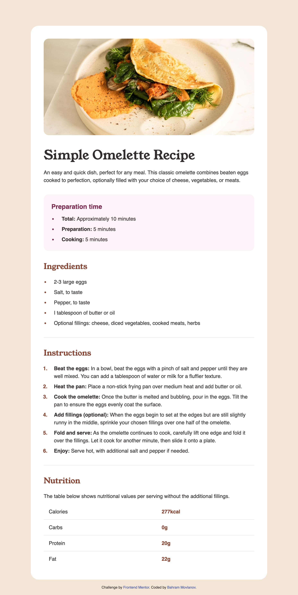

# Frontend Mentor - Recipe page solution

This is a solution to the [Recipe page challenge on Frontend Mentor](https://www.frontendmentor.io/challenges/recipe-page-KiTsR8QQKm). Frontend Mentor challenges help you improve your coding skills by building realistic projects.

## Table of contents

- [Frontend Mentor - Recipe page solution](#frontend-mentor---recipe-page-solution)
  - [Table of contents](#table-of-contents)
  - [Overview](#overview)
    - [Screenshot](#screenshot)
    - [Links](#links)
  - [My process](#my-process)
    - [Built with](#built-with)
    - [What I learned](#what-i-learned)
    - [Continued development](#continued-development)
    - [Useful resources](#useful-resources)
  - [Author](#author)

## Overview

### Screenshot

### Links

- Solution URL: [Add solution URL here](https://movlan.github.io/Frontend_Mentor-recipe-page/src/)

## My process

### Built with

- HTML
- [Tailwindcss](https://tailwindcss.com/) - For Styles

### What I learned

This work is my first time using Tailwindcss to this extent. There is still a lot more to learn about Tailwind.

### Continued development

I need to learn more about responsive design and changing default Tailwind settings. It would be fantastic to try Tailwind on a bigger project.

### Useful resources

- [Tailwindcss Documentation](https://tailwindcss.com/docs) - Docs are always helpful.

## Author

- Website - [Bahram Movlanov](https://www.bahram.dev)
- Frontend Mentor - [@movlan](https://www.frontendmentor.io/profile/movlan)
- Twitter - [@bmovlanov](https://www.twitter.com/bmovlanov)
